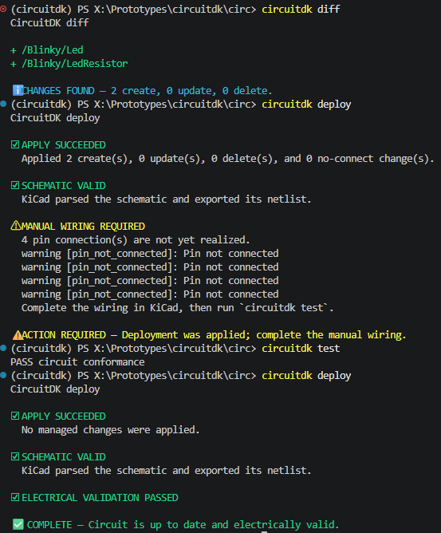

# CircuitDK

[English](README.md) | [日本語](README.ja.md)

CircuitDKは、回路の論理と意図をPythonで定義しながら、KiCad上で回路図を編集・整理できる
ツールです。部品、コードが管理する属性、意図した接続はPythonが所有し、シンボルの配置、
配線、ラベル、見た目はKiCadが所有します。

Infrastructure as Codeで馴染みのある操作により、回路の変更を確認して適用できます。

```console
circuitdk diff
circuitdk deploy
circuitdk test
```



> [!NOTE]
> CircuitDKは現在、KiCad 10プロジェクト向けの実験的なツールです。製品用ハードウェアに
> 使用する前に、[現在の対象範囲](#現在の対象範囲)を確認してください。

## CircuitDKを使う理由

グラフィカルな回路図は読みやすく整理しやすい一方、回路の意図をレビュー、再利用、テスト
することは容易ではありません。コードだけから回路図を生成すると再現性は得られますが、
生成された図を人間が継続的に編集することが難しくなります。

CircuitDKでは、コードと回路図の両方を有用な状態に保てます。

- 部品、値、フットプリント、ネット、再利用可能な回路の意図を通常のPythonで定義する
- 回路図を変更する前に、追加、変更、削除を確認する
- 回路図の見た目はKiCadで編集可能。手動でもMCP経由でも、整えた配置と配線を維持する
- コードが管理する属性のdriftを検出する
- KiCad回路図がコードで宣言した接続を実現しているか検査する
- **AIフレンドリー：** 回路論理をテスト可能なPythonで構造化。AI支援による設計の信頼性を
  高める
- ローカル環境やCIで、回路のsemantic checkとKiCad ERCを組み合わせる

CircuitDKは回路図rendererではなくreconcilerです。コードを論理設計の正としながら、回路図は
編集可能なまま維持します。

## 他の方法との違い

CircuitDKの最大の特徴はreconciliationです。コードが回路の意図を所有する一方で、回路図の
見た目はKiCadが所有します。

| プロジェクトの形式 | 回路の記述 | KiCad回路図のワークフロー | 主な目的 |
| --- | --- | --- | --- |
| CircuitDK | Python | 見た目を維持しながら編集可能な回路図へ反映 | Desired state、drift、deploy、semantic test |
| SKiDL | Python | Pythonの回路モデルからEDA出力を生成 | プログラムによる回路・netlist構築 |
| atopile | atopile言語 | ツールが管理するハードウェア設計ワークフロー | 宣言的なハードウェア設計とパッケージ再利用 |
| KiCadの直接script | APIに依存 | scriptの実装による | 独自のeditor・ファイル自動操作 |

CircuitDKは、論理設計についてはPythonを正としつつ、KiCad回路図を丁寧に整理された人間が
読みやすい設計資料として維持したいユーザーを対象としています。

## できること

- KiCadの汎用部品を宣言し、projectまたはglobal symbol libraryからpinを解決する
- 決定的な論理IDを持つsignal、power、ground netをモデル化する
- 色付きsemantic diffで、管理対象のsymbolとno-connectの変更を確認する
- 既存の配置と配線を維持したままsymbolを追加・更新する
- 前回のdeploy後にKiCad側で発生したmanaged stateのdriftを検出する
- 意図した接続とKiCad自身が出力したnetlistを比較する
- KiCad ERCを実行し、deployの成功と手動配線待ちを区別する
- `no_connect()`で意図的な未使用pinを明示する
- pull-up、pull-down、LED indicator、voltage divider、decouplingを再利用する
- 既存回路図のsymbolをadoptし、置換せずに論理IDを変更する
- 解決したsymbol・footprint libraryの取得元をlock fileに記録する

## 必要な環境

- KiCad 10
- Python 3.13以降
- [uv](https://docs.astral.sh/uv/)
- `kicad-cli`を実行できるplatform

Windowsでは、次のKiCad 10標準install先を自動検出します。

```text
C:\Program Files\KiCad\10.0\bin\kicad-cli.exe
```

別の場所へinstallしている場合は、`CIRCUITDK_KICAD_CLI`に実行ファイルのpathを指定します。

## インストール

PyPIからCLIをuv toolとしてインストールします。

```console
uv tool install circuitdk
circuitdk --version
```

### Sourceからのインストール

source checkoutを使う場合は、そのrootへ移動してCLI packageを直接インストールします。

```console
cd circuitdk
uv tool install ./packages/circuitdk
circuitdk --version
```

checkoutしたsourceから、独立した非editable commandとしてinstallされます。新しいversionを
pullした後は、`uv tool install --reinstall ./packages/circuitdk`を再実行してください。

## Quick start

この例では、2 pinの電源入力connectorから点灯するLEDを記述します。

```text
J1.1 (VDD) -> resistor -> LED -> J1.2 (GND)
```

最初にKiCad 10で空の回路図`hardware/blinky.kicad_sch`を作成します。次に、
`circuitdk.toml`と同じdirectoryへ`circuit.py`を作成します。

```python
from circuitdk import Circuit, KicadProject, Part, V, kohm

circuit = Circuit("Blinky")

vdd = circuit.power("VDD", voltage=5 * V)
gnd = circuit.ground("GND")

power_input = Part(
    circuit,
    "PowerInput",
    symbol="Connector_Generic:Conn_01x02",
    footprint="Connector_PinHeader_2.54mm:PinHeader_1x02_P2.54mm_Vertical",
    pin_overrides={"VDD": "1", "GND": "2"},
)

resistor = Part(
    circuit,
    "LedResistor",
    symbol="Device:R",
    value=1 * kohm,
)

led = Part(
    circuit,
    "Led",
    symbol="Device:LED",
)

vdd.connect(power_input.pin("VDD"), resistor.pin("1"))
circuit.connect(resistor.pin("2"), led.pin("A"))
gnd.connect(led.pin("K"), power_input.pin("GND"))

# Assembly固有の選択です。BOMやvariant dataから読み込むこともできます。
resistor.footprint = "Resistor_SMD:R_0603_1608Metric"
led.footprint = "LED_SMD:LED_0603_1608Metric"

project = KicadProject(circuit, "hardware/blinky.kicad_sch")
```

`circuitdk.toml`を作成します。

```toml
[project]
entrypoint = "circuit:project"
state_directory = ".circuitdk"
```

管理対象symbolの変更を確認し、適用します。

```console
circuitdk diff
circuitdk deploy
```

新しいsymbolはstaging areaへ配置されます。KiCadで回路図を開き、symbolを整理して、宣言した
3本の接続を配線してください。CircuitDKは意図的にwire routingを行いません。配線するまでは、
`deploy`はmanaged stateの適用に成功したことと、手動配線が必要なことを表示します。

配線後に結果を検査します。

```console
circuitdk test
```

以降のdeployでは、KiCad上で編集した位置と配線形状が維持されます。

## Footprintの管理

footprintをどこで選択するのが適切かは、その選択を何が決定するかによって異なります。

### 部品固有またはdefaultのfootprint

特定のMCU、module、connectorなど、有効なfootprintが一意に決まる部品や有用なdefaultがある
部品では、部品と同時にfootprintを指定します。Quick startの電源connectorはこの方法で定義
しています。

```python
power_input = Part(
    circuit,
    "PowerInput",
    symbol="Connector_Generic:Conn_01x02",
    footprint="Connector_PinHeader_2.54mm:PinHeader_1x02_P2.54mm_Vertical",
    pin_overrides={"VDD": "1", "GND": "2"},
)
```

### Assembly固有のfootprint

抵抗、capacitorなど、実装や調達によってpackageが変わる部品では、回路の論理を定義する
段階ではfootprintを省略し、後から割り当てます。Quick startでは、小さく自己完結した例にする
ため直接代入しています。

```python
resistor.footprint = "Resistor_SMD:R_0603_1608Metric"
led.footprint = "LED_SMD:LED_0603_1608Metric"
```

CircuitDKの定義fileは通常のPythonなので、より大きなprojectでは同じ割り当てをBOMや
assembly variantのdataから読み込めます。

`R1`や`D1`のようなKiCad referenceではなく、CircuitDKのstable logical IDを使用します。
KiCadのannotationによってreferenceは変わる可能性がありますが、construct pathは安定して
いるためです。

```csv
circuit_id,footprint
/Blinky/LedResistor,Resistor_SMD:R_0603_1608Metric
/Blinky/Led,LED_SMD:LED_0603_1608Metric
```

現在のAPIでは、各`Part`とその`path`を直接参照できます。そのため、小さなhelperでCSVの
割り当てを検証して適用できます。

```python
import csv
from collections.abc import Iterable
from pathlib import Path

from circuitdk import Part


def apply_footprints(parts: Iterable[Part], source: Path) -> None:
    parts_by_id = {part.path: part for part in parts}

    with source.open(encoding="utf-8", newline="") as file:
        assignments = {
            row["circuit_id"]: row["footprint"]
            for row in csv.DictReader(file)
        }

    unknown = assignments.keys() - parts_by_id.keys()
    missing = parts_by_id.keys() - assignments.keys()
    if unknown:
        raise ValueError(f"assembly data contains unknown parts: {sorted(unknown)}")
    if missing:
        raise ValueError(f"assembly data has no footprint for: {sorted(missing)}")

    for circuit_id, footprint in assignments.items():
        parts_by_id[circuit_id].footprint = footprint
```

回路を構築した後、projectを作成する前に、選択したassembly dataを適用します。

```python
apply_footprints(
    (resistor, led),
    Path("assembly.csv"),
)

project = KicadProject(circuit, "hardware/blinky.kicad_sch")
```

## 基本的なワークフロー

```text
Pythonを編集
    |
    v
circuitdk diff
    |
    v
circuitdk deploy
    |
    v
KiCadで配置・配線
    |
    v
circuitdk test
```

| Command | 目的 |
| --- | --- |
| `circuitdk synth` | Pythonから決定的なdesired circuitを構築する |
| `circuitdk diff` | コードが所有する回路図stateの変更を確認する |
| `circuitdk deploy` | 管理対象の部品と属性をatomicに適用する |
| `circuitdk test` | 接続、intent rule、pin coverage、library、ERCを検査する |
| `circuitdk drift` | 前回のdeploy後にKiCadで変更されたmanaged fieldを検出する |
| `circuitdk adopt` | 既存のKiCad symbolをCircuitDKの管理下に置く |
| `circuitdk move` | symbolを置換せずにstable logical IDを変更する |
| `circuitdk lock` | 解決されたlibrary definitionを記録または検証する |
| `circuitdk inspect` | desired stateとactual managed stateをJSONで確認する |

`deploy`は、CircuitDKがmanaged stateを適用できたかを答えます。`test`は、手動配線を含む
回路図全体が宣言した回路と一致しているかを答えます。

## コードとKiCadの所有範囲

| Pythonが所有 | KiCadが所有 |
| --- | --- |
| 管理対象symbolの存在 | Symbolの座標 |
| Symbol library ID | 回転とmirror |
| Valueとfootprint | Wireとjunctionの形状 |
| BOM、board、DNP flag | Labelとfieldの位置 |
| 意図したpin接続 | 注記とgraphic |
| 明示的なno-connect intent | 回路図全体の見た目 |

KiCad上でmanaged symbolを移動、回転、再配線しても、CircuitDKが元へ戻すことはありません。
一方、valueやfootprintなど、コードが所有するfieldをKiCad上で変更するとdriftになります。
次回のdeployでは、Pythonで宣言した値に戻ります。

CircuitDKはwireを作成、変更、削除しません。コードから部品を削除した結果、不要なwireが
生じた場合はKiCad上で手動で整理してください。

## 回路の意図をテストする

再利用可能なconstructに、部品だけでなく、その部品が存在する理由も記述できます。

```python
from circuitdk import DecouplingCapacitor, LedIndicator, nF, pull_down

LedIndicator(
    circuit,
    "StatusLed",
    drive=controller.pin("STATUS"),
    return_to=gnd,
    series_resistance=1 * kohm,
)

pull_down(
    circuit,
    "EnableDefault",
    signal=controller.pin("ENABLE"),
    ground=gnd,
    resistance=10 * kohm,
)

DecouplingCapacitor(
    circuit,
    "ControllerDecoupling",
    power_pin=controller.pin("VCC"),
    ground=gnd,
    capacitance=100 * nF,
)
```

これにより、単なるファイル構文だけでなく、期待した接続、意図しないshort、current-limiting
resistance、decoupling、未使用pinの明示などを検査できます。

```python
controller.pin("NC").no_connect()
```

## 既存の回路図で使用する

KiCad referenceを指定して既存symbolをadoptします。

```console
circuitdk adopt --reference R1 --id /Board/StatusLed/Resistor
```

非表示の`CircuitDK:ID` propertyが、PythonとKiCadを結ぶstable linkになります。その後コードを
refactorする場合は、moved declarationにより同一性を維持できます。

```python
project = KicadProject(
    circuit,
    "hardware/board.kicad_sch",
    moved={"/Board/OldName": "/Board/NewName"},
)
```

## 現在の対象範囲

- 現在はKiCad 10の回路図を対象としています。
- Wire routingは意図的に手動としています。
- Hierarchical sheet管理、design block、label stubによる接続は未実装です。
- deploy前に回路図を保存して閉じてください。editor上の未保存stateは安全にreconcileできません。
- CircuitDKは宣言したintentとKiCad ERCの結果を検査します。回路が電気的に正しいことや、
  製造に適していることを証明するものではありません。

## ドキュメント

- [Getting started](docs/getting-started.md)では、より詳しいtutorialとcommandの使い方を説明します。
- [Python API reference](docs/api-reference.ja.md)では、公開class、method、属性、再利用可能な
  construct、単位を簡潔に説明します。
- [CLI reference](docs/cli.md)では、command、終了code、deploy status、JSON出力を説明します。
- [Architecture](docs/architecture.md)では、reconciliation、ownership、state、安全性を説明します。
- [Roadmap](docs/roadmap.md)では、現在のrelease対象と将来の予定を説明します。
- [Development](docs/development.md)では、contributor向けのsetupと検証方法を説明します。
